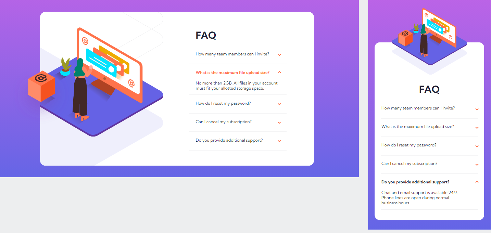

# Frontend Mentor - FAQ accordion card

## Welcome to my GitHub world! 👋

Thanks for checking out my take on this front-end coding challenge.

[Frontend Mentor](https://www.frontendmentor.io) challenges help us improve our coding skills by building realistic projects.

## Overview

My challenge was to build out this FAQ accordion card and get it looking as close to the design as possible.

### The challenge

Users should be able to:

-   View the optimal layout for the component depending on their device's screen size
-   See hover states for all interactive elements on the page
-   Hide/Show the answer to a question when the question is clicked

### Screenshot

### Links

-   Solution URL: [Add solution URL here](https://your-solution-url.com)
-   Live Site URL: [Add live site URL here](https://your-live-site-url.com)

## My process

### Built with

-   HTML5
-   CSS
-   Flexbox
-   Mobile-first workflow
-   JavaScript

## Author

-   Twitter - [@LjCodes](https://www.twitter.com/LjCodes)
